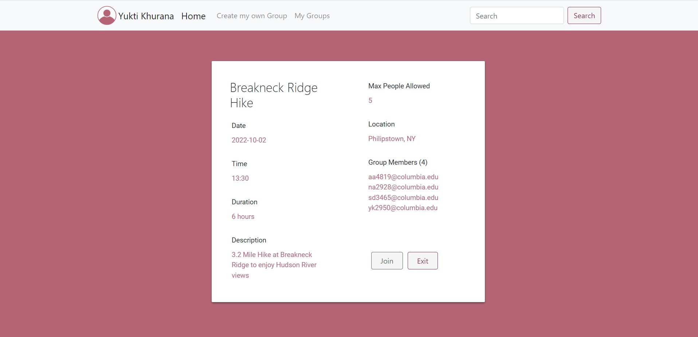
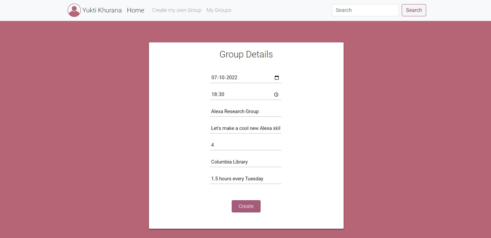
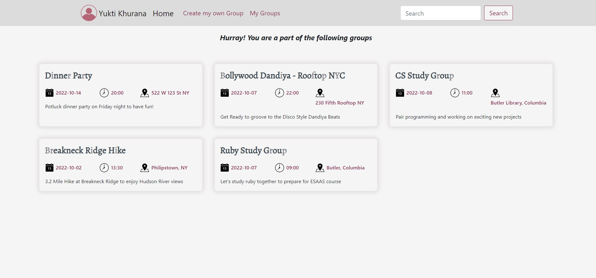
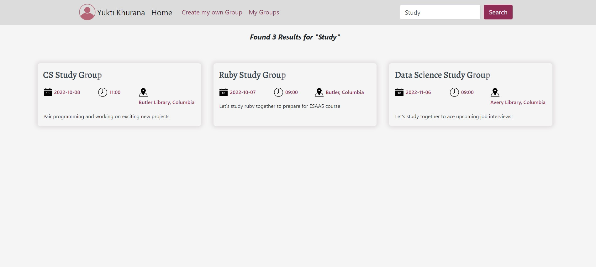
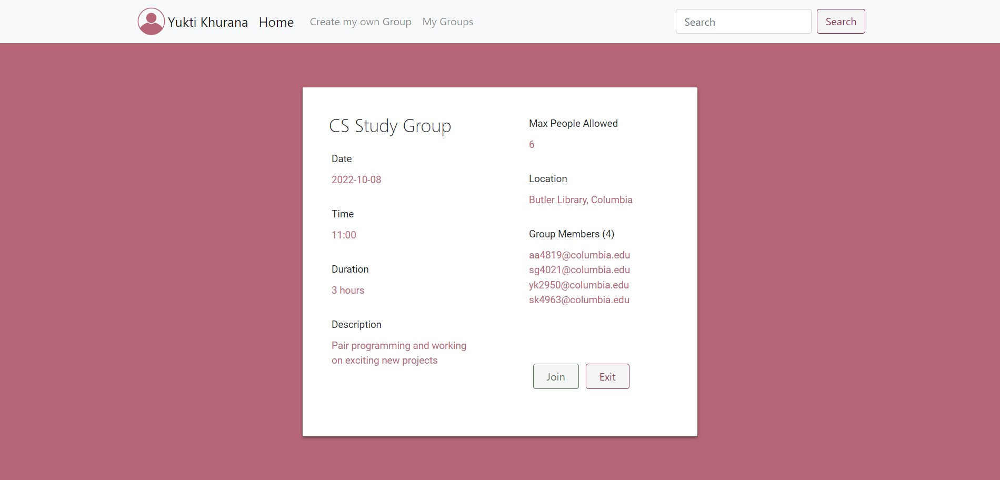

# Student-Group-Finder-App
Group Finder App: A website that helps students find others having common interests for a wide variety of group activities.

Demo Link: https://www.youtube.com/watch?v=colyzMxy2QU

| | |
|:-------------------------:|:-------------------------:|
|User Login/Registration  |  Home Page for Exploring/Creating Groups  |
|Find from all groups   |  Join a group if limit permits  |
|Create your own group  | Easy Access to Previously joined groups/activities  |
|Easy Search by keywords  | Exit group activity as per convenience  |

### Configuration Details
  This app uses firebase as the backend database and needs firebase configuration details to run.
  
  #### 1. Create a new Firebase project using the following documentation: <br>
  
    https://firebase.google.com/codelabs/firebase-web#2
  
  #### 2. Enter your firebase project details in the `server.py` file <br>
  ```
    config = {
      "apiKey": "",
      "authDomain": "",
      "databaseURL": "",
      "storageBucket": ""
    }
  ```
  
  #### 3. Enter the Service Account details in the `server-account.json` file. The firebase.py file can be used for a variety of firebase operations.
  ```
    {
      "type": "",
      "project_id": "",
      "private_key_id": "",
      "private_key": "",
      "client_email": "",
      "client_id": "",
      "auth_uri": "",
      "token_uri": "",
      "auth_provider_x509_cert_url": "",
      "client_x509_cert_url": ""
    }
  ```
  
  
### Steps to Run
  #### Install virtualenv
  `py -2 -m pip install virtualenv`

  #### Create Environment
  `mkdir <project name>`
  `cd <project name>`

  #### Activate Environment
  `<name of environment>\Scripts\activate`

  #### Install Flask
  `pip install Flask`
  
  #### Set FLASK_APP environment variable.
  `setx FLASK_APP "server.py"`

  #### Run the application
  `flask run`  
  or  
  `python server.py `
