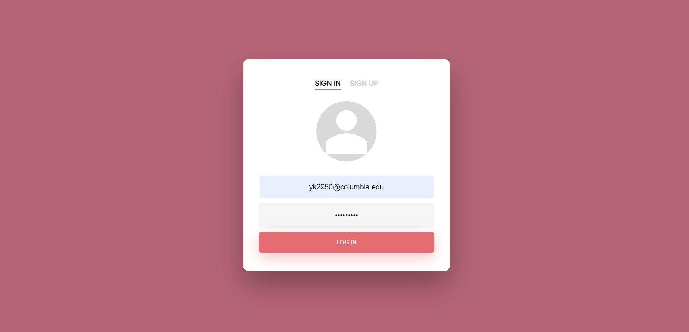

# Student-Group-Finder-App
Group Finder App: A website that helps students find others having common interests for a wide variety of group activities.

Demo Link: https://www.youtube.com/watch?v=colyzMxy2QU

### Configuration Details
  This app uses firebase as the backend database and needs firebase configuration details to run.
  
### Steps to Run
  #### Install virtualenv
  `py -2 -m pip install virtualenv`

  #### Create Environment
  `mkdir <project name>`
  `cd <project name>`

  #### Activate Environment
  `<name of environment>\Scripts\activate`

  #### Install Flask
  `pip install Flask`
  
  #### Set FLASK_APP environment variable.
  `setx FLASK_APP "server.py"`

  #### Run the application
  `flask run`  
  or  
  `python server.py `
